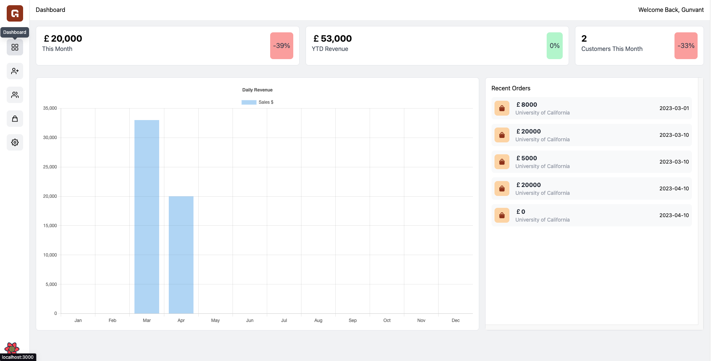
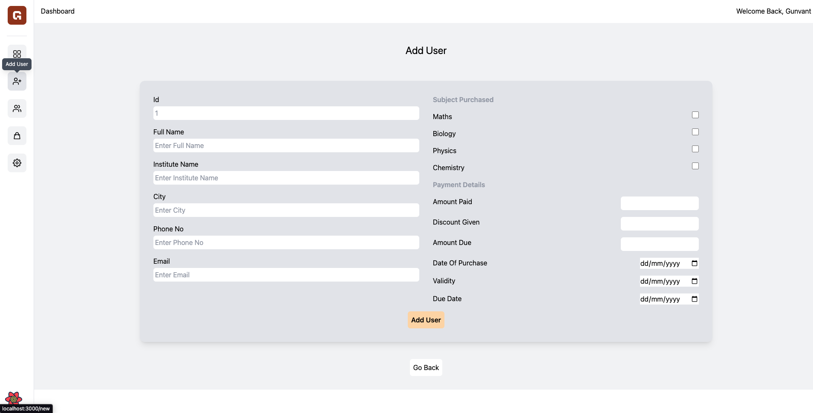
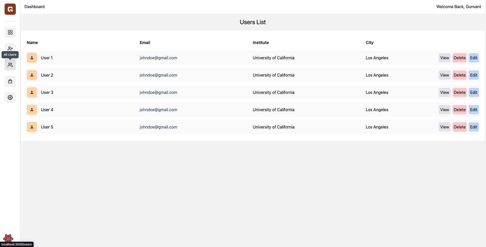
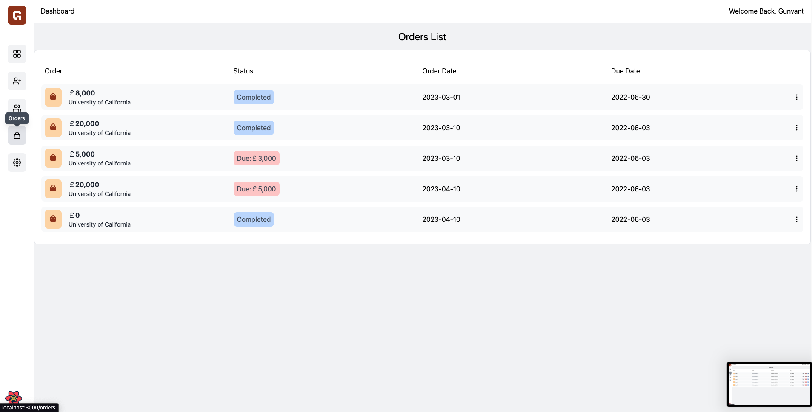
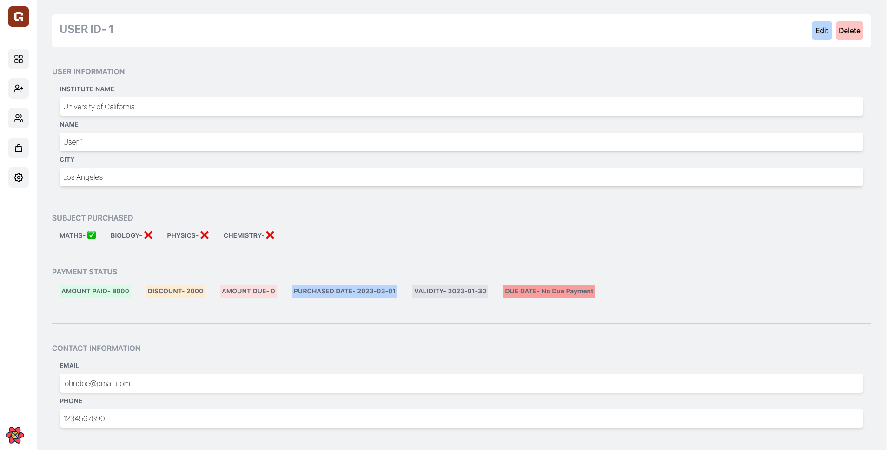
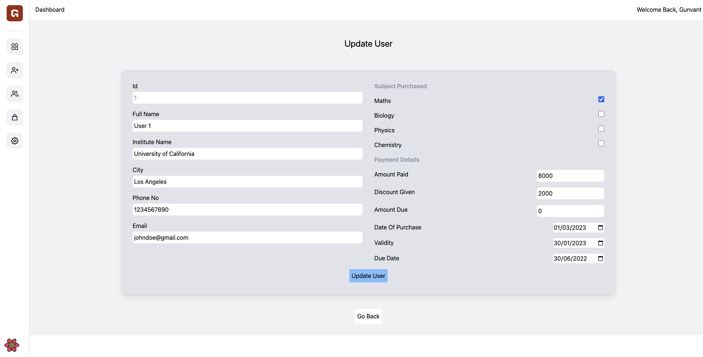

# About Project

## Description

- This is a simple and clean dashboard for a SAAS business. Admin can manage enquiries, users, plans, payments, and more.
- Zod is used for data validation.
- React Query is used for data fetching, optimistic updates, and caching.
- React Hook Form is used for forms.
- Mock Service Worker is used for mocking API calls.
- Jest is used for unit testing.
- Constantly adding new features and improving existing ones.

## Technologies

- Next.js
- React Query
- React Hook Form
- Zod
- Mock Service Worker
- Jest
- Tailwind CSS
- TypeScript
- react chartjs 2

## Here is the link to the live demo

- [Live Demo](https://institute-crm.vercel.app/)

## Here are some screenshots of the app

### Dashboard

### Add User Page

### Users Page

### Orders Page

### User Details Page

### Update User Page

